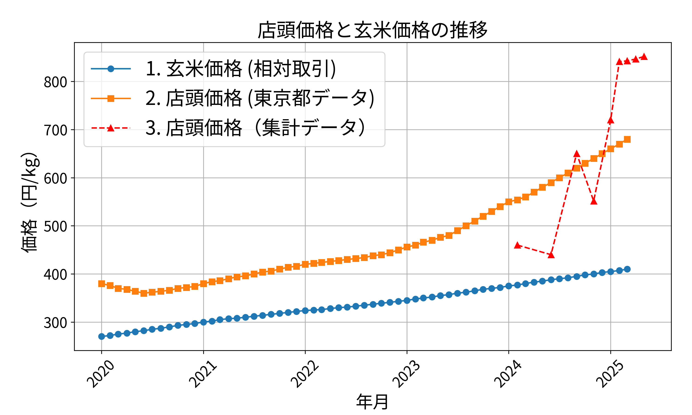

# 導入

##### 引用したデータについて
1. 玄米の相対取引価格（流通段階価格）
- 提供元：農林水産省
- データ名：​令和6年産米の相対取引価格・数量について（令和5年12月）
- URL：​https://www.maff.go.jp/j/seisan/keikaku/soukatu/aitaikakaku.html
- 著者：農林水産省

2. 精米小売価格（東京都区部）
- 提供元：総務省統計局
- データ名：​小売物価統計調査（東京都区部）
- URL：​https://www.e-stat.go.jp/stat-search/files?-page=1&toukei=00200521&tstat=000001020141
- 著者：​総務省統計局

近年、日本の米市場において価格の高騰が注目を集めている。特に2024年以降、店頭での白米価格が「前年の倍」などと報道され、消費者の不安を煽る一因となっている。しかしその一方で、玄米の流通価格や政府公表の統計との間には乖離も見られ、実態の把握は必ずしも容易ではない。
例えば上図の「店頭価格(東京都)と玄米価格(市場全体)の推移」では2023年以降の店頭価格の大きな上昇が見られる。

こうした混乱の背景には、米の流通構造そのものが抱える複雑さがある。米価を議論する際に重要なのは、価格を単に「上げ下げ」するのではなく、「安定させる」ことであり、それを支える制度的・実務的な基盤を理解する必要がある。たとえば、米の価格調整や需給の均衡を取るために、政府が備蓄米の管理や放出を行っているほか、ミニマム・アクセス（MA）米と呼ばれる輸入米の存在もある。

このMA米は、輸入価格が国産米よりも低いため、本来であれば価格高騰時に市場への供給を補う「調整弁」としての役割が期待される。しかし現実には、輸入量が事前に固定されており、状況に応じた柔軟な供給ができないため、2024年のような価格高騰局面でも価格抑制効果は限定的である。MA米の年間輸入枠は77万トンに設定されているが、あくまで数量が決まっているため、需給の急激な変動には対応しきれない。

さらに、備蓄米についても制度的な調整機能が備えられているが、その在庫総量はおおよそ5年で100万トン程度、単年度換算でおよそ20～21万トンに相当し、量的にはMA米よりも規模が小さい。にもかかわらず、2024年度にはその備蓄米に関して「消えた21万トン」という帳簿上の不整合が指摘される事態となり、制度運用の透明性や正確性に対する疑念が浮上している。なお、この「21万トン」は偶然にも、政府が1年間に備蓄すべきと定めている数量と一致している点が特筆される。

米は最終的に家庭で消費されるだけでなく、一定量が政府備蓄として保管されたり、米菓などの加工用、輸出用、さらには飼料用として用途を変えながら流通していく。つまり、「主食用」として棚に並ぶ米だけが市場を構成しているわけではなく、目に見えない形で姿を変えながら消費・再流通していく構造にある。

本稿では、こうした米の生産・流通・消費における制度や実態を、現状の課題とともに整理し、将来的な制度改善やトレーサビリティ強化の視点から再構築の方向性を探る。価格をめぐる表面的な議論から一歩踏み込み、日本の米市場の根幹に迫る構成を目指す。

# 情報管理・制度設計の困難性
米の流通・消費構造を一望したとき、その全体像は想像以上に複雑である。単に「生産されて消費される」だけではなく、複数のフェーズと多様な分岐点を持ち、トレーサビリティ（流通経路の追跡可能性）を阻む要素が随所に存在する。

本構想で想定される主要フェーズは以下の通りである：

生産 → 集荷 → 流通（玄米）→ 精米 → 流通（精米）→ 消費

この基本的な流れに加えて、さらに以下のような特殊な流入口・出口が存在する：

- 生産フェーズの変種としての備蓄米の放出・輸入米（MA）
既に市場を離れている米が再度流通に加わることで、流通量の一致性を乱す。

- 精米によって約10%程度重量が減少するため、玄米ベースで統一された制度設計がなければ量の整合性が取れない。

- 消費フェーズにおける多様な用途
精米されたものがそのまま家庭用主食として流れるとは限らず、加工用、業務用、輸出、あるいは再備蓄など複数の方向へ分散される。また、精米を経ずに飼料や工業用に流れるケースもある。

## 情報構造の転換となるフェーズ
### 集荷フェーズ
生産段階では「どの農家がどの品種をどれだけ作付けし、どれだけ収穫したか」という比較的直線的な記録で済むが、集荷された後は、米が個別農地単位ではなく混在したロットとして扱われるようになる。
また、等級検査や用途の振り分け（主食用／加工用など）がこの段階で行われるため、以降のトラッキングには分類ごとの情報が不可欠となる。
また、この後の玄米での流通フェーズでは様々な業者が、例えば集荷業者も兼ねるようなJAや大手卸、それらから買い付けつける中小卸など、が入り組んでいる。
また、玄米ロッドも分割、または統合され用途も変更される可能性もあり非常に複雑になることが考えられる。
ここで生産と流通(玄米)を結ぶフェーズとして集荷フェーズは大変重要である。

### 精米フェーズ
また、主食用に目を向けるとほぼすべてが精米されている。精米はぬかなどを取り除くため重量が減るつまり精米することでコメ全体の量が減少することになる。
しかしながら加工用や飼料用などの目的では精米されないことが一般的である。また、備蓄米も玄米のまま備蓄される。
さらに、精米されると品質保持の観点から複雑な流通はせず消費される。この消費は極一部の例外を除き主食として食べられる。
このように、精米は主食用とそれ以外を分けるのに重要なフェーズである。
しかしながら、家庭の主食用は細分化される特にスーパーなどを含む小売店ベースであってもそれらすべてを追跡するのは現実的でないと考えられるのでどこかの時点で消費されたとみなすが現実である。

このような構造的複雑さを前提にする限り、直感的なトレーサビリティやシンプルな数量把握は成立しえない。ゆえに、フェーズごとの情報を最適な単位で設計し、必要な粒度での接続性を持たせる仕組みが不可欠である。

次章では、そのための情報構造の一例として、フェーズ別に管理されるべき情報の設計テーブルを提示する。

# 具体的なDBテーブル案
本システムにおけるトレーサビリティ設計では、米の流通全体を複数フェーズに分割し、それぞれのフェーズで適切なデータテーブルを設置しています。以下に各テーブルの役割と設計意図を示します。

## 生産フェーズ
生産フェーズでは実際の田んぼに紐ついた生産地とそこから収穫される収穫テーブルに分ける。
収穫は生産地と次の集荷場をつなぐものであり実際の流通を表すものである。

### 生産地テーブル
- 生産地ID
- 生産者
- 品種
- 面積
- 予測収量
- 住所(地域・気候ファクターチェック用)
- 収穫IDのリスト

### 収穫テーブル
- 収穫ロッド(ID)
- 親の生産地ID
- 収穫日
- 品種
- 量

このテーブルには、実生産データに加えて、政府備蓄米の放出やMA米（輸入米）など、みなし生産データも含める。

## 集荷フェーズ
集荷フェーズは前章で述べたように総量把握のために非常に重要なフェーズで集荷場単位で管理する。
後述するように本DBシステムでは一年度ごとに更新することを想定するためにその期間中に全量の整合性をここで合わせる。また、次年度への繰り越しのフィールドを持つ。

### 集荷場テーブル
- 集荷場ID
- 事業者
- 所在地
- 収穫IDのリスト
- 流通ノードIDのリスト
- 備蓄量(上二つのリストからの計算)
- 前年度繰越量
 
ここから先はいろいろ混在する流通フェーズIDで管理され生産フェーズのIDへさかのぼることはできない。

## (玄米/白米)流通フェーズ
このフェーズはコメの流通としては最も広く複雑になることが予測される。
流通を表す流通テーブルと流通で集められた、保管やブレンド含む、流通ノードテーブルに分ける。
流通が“線”でノードが“交点”であるような構成をとる。

### 流通テーブル
- 流通ID
- 流入ノードID
- 流出ノードID
- 品種
- 数量
- 用途(主食用/加工用/飼料用など)

このテーブル設計は玄米/白米で共用する。
別テーブルにするか、フラグで管理するかなどは要議論

### 流通ノードテーブル
このテーブルは後述する精米/消費テーブルの基底テーブルであり同一的に管理される。
そのための主キーとして働くのがノードIDである
- ノードID(主キー)
- 流入するIDのリスト
- 流出するIDのリスト
- 種類(集荷/保管/精米/消費 etc)
- 集荷場ID/保管所ID/精米所ID

流入IDも流出するIDも基本的には白米/玄米は同一の流通IDであるが、以下の場合は別のIDになる。
集荷の場合は流入IDは収穫IDになる。
また、派生テーブルで扱うが精米の場合も流入する流通IDは玄米であるが流出する流通IDは白米の流通テーブルのものになる。

### 保管所テーブル
流通ノードから参照されるだけのテーブル。

- 保管所ID
- (保管された流通ノードIDのリスト)        
- 事業者
- 所在地

## 精米フェーズ
ここでは主に主食用に用いられる総量を把握するために用いる。

### 精米所テーブル
- 精米所ID
- 所在地
- 事業者

その他、付帯情報として精米能力(t/日)などのフィールドは要検討

### 精米テーブル
このテーブルは玄米と白米の流通が交わる特殊な流通ノードとみなせる(サブタイプ)。
玄米流通ID(流入)と精米流通ID(流出)は一対一である。

- ノードID(主キー)
- 流入する流通ID(玄米流通テーブル)
- 流出する流通ID(精米流通テーブル)
- 精米所ID(住所の代わり)
- 処理日
- 精米割合(%)

事業者は精米所から辿れるとして本テーブルに入れない

## 白米流通フェーズ
基本的に玄米と同じ構成

## 消費フェーズ
これは流入する流通IDのみ持って流出する流通IDを持たない特殊な流通ノードの役割(サブタイプ)を持つ。

### 消費テーブル
- ノードID
- 流入する流通ID
- 消費先(家庭/業務/加工用/飼育用/備蓄/輸出/その他)
- 事業者
- 消費地
- 消費完了日

家庭用主食はパッケージングされた時点で消費されたとみなす、つまりパッケージ化した業者が事業者。

# 想定される運用と困難性
本システムの主な目的は米のトレーサビリティ、つまり流通の把握、総量の整合性の確認である。そのために前述のようなテーブル構造を持ったDBシステムを提案した。
これらを運用するにあたっていくつかのポイントとなることが考えられる本章ではそれらについて紹介・解説したい。

## 一年毎の更新
米は一年をかけて育成・収穫されるためにそのDBは一年毎の更新するべきであろう。
その更新時期は流通する米が次の年の新米に切り替わる収穫時期前後が適当だと考えられる。しかしながら、その時期は従来よく使われる1月1日や新年度切り替えの4月1日では不便であることに注意が必要である。

また、更新時の運用については一定期間、2週間から1カ月程度の移行期間を儲け、旧DBの各ノードからの特別な消費(出庫)として新DBの各集荷場への特別な入庫として手動入力させるべきであろう。
これは、自動化による一見総量は整合性とれるがその実態を誰も把握していないような**見えないブラックボックス化**を避けるためである。そうした上でも全数で整合性を取るのは困難であると考えられ最終的にそれらは自動的に更新することであろう。しかしながら、こういった自動化で更新されるものはなるべく抑えるべきであることはもう一度強調しておく。

また、この更新により現在以前のDBについては整合性が取られており様々な検証に利用可能なこともこのような手法を取る利点であると考えられる。
さらに情報の更新されるのは現在使っているDBのみであり過去のDBは更新されずに参照されるだけになり情報の入出力は非対称的になる。

## 出力システム
前述のように本システムの入出力は非対称になる。
米は我が国では国民の主食、つまり基本的な戦略物資である。そのためこの情報は広く行政、業者・生産者、マスコミ、研究者、さらには国民一般が参照できそれまでの施策等を検証出来ることが求められる。
そのような出力システムとしてはWebAPIが適当と考えられる。

また、本システムの利便性・重要性を周知させるためにこのWebAPIを用いたホームページの整備等も必要と思われる。
広くWebAPIシステムが用いられるためには使いやすい仕様とそれらを正しく記述した仕様ドキュメントが重要であるがそれらを整備するためにも実際にWebAPIを用いるチームの提言とDBチームとの深い連携は重要であり、そのためにホームページは必要であろう。

## 入力システム
入力システムは出力システムとは逆に米の生産者・業者、あるいは行政の関係者など限られた人がアクセスするものである。
そのためWebで広くアクセス出来るものでは無く、専用の端末等を用いてアクセスされるべきだと想定される。

とは言うものも流通総量は膨大であり関わる生産者・業者の数は膨大だと考えられる。特に、生産量が減少する中で生産量の確保は最も大切な事項でここで行政などの補佐により生産者の負担を減らすことが重要である。

また、流通は複雑でありすべてを行政が関わることは現実的ではなく、多くの部分は事業者に任せることになると考えられる。
しかし、業者も集荷業者や精米事業も兼ねる大手流通業者、そこから卸される中小流通事業者、さらに小売に近い小規模(精米を兼ねる場合もある)流通業者等があり、さらには事業用を扱う大手飲食チェーン事業者があり流通経路は複雑である。
また、酒米・もち米は特殊な品種であり、それらに加えて加工用・飼料用も主食用とは違う複雑な経路を辿らない特殊な流通経路であるが生産・流通・消費の整合性を考える場合、無視できない経路でありそれらの業者の協力は必要不可欠である。

## 生産者・行政・業者の連携
上記のように生産フェーズでは行政が大きく関わっているが一部業者も関わっており、また流通フェーズではさらに様々な業態の業者が関わっている。
さらに輸入米(MA米)や備蓄米等の政府手動の流通経路とうもかなりのウェイトがありどの程度の粒度の情報が必要かまた、誰がどう入力するか等の問題は単純ではなく生産者・政府・業者の協議が必要であると考えられる。

## プラットフォーム
これらの基盤プラットフォームは規模が大きくなることが予測されることなどからAWSやGCP等のスケーラビリティを持った大規模インフラが望ましいが米が国民の主食であり戦略資源であることから国産のインフラであることが必須条件であると考えられる。
また、それらの運用団体は政府等であるべきである。

## 構築の道筋
このような大規模システムを構築するに当たってテスト的に構築していくことは必要不可欠である。そのために、米の高騰が問題になった2024年度産もしくは2023年のデータについてDBを構築していくことはあらゆる意味で有用だと考えられる。
ここで注意するべき点としてこれらのデータは最初からこういったシステムに組み込まれることは想定されていないのでデータの整合性は取れない、さらにはかなり大きく乖離すると想定される。
しかしながら、これらのデータの流れを追うことはなぜこのような事態に陥ったかの検証をすることは重要だと考えられる。

ここでこれらのデータは必ずしも時間的に順序だってデータが登録されないという困難性もあり、情報の断片から登録されることになる。これは情報の断片化のテストケースとして役立つ一方、出来るDBには多数の断片化したデータが多数あることは覚悟・明示するべきであろう。
また、入力システムに関しても完璧では無く、色々なパターンが試されることが想定されそれらもこうした事情に拍車を書けるであろう。
# まとめ

本プロジェクトでは、コメの生産から流通、消費に至るまでの一貫したトレーサビリティを実現するためのシステム設計を行った。
実際の生産と流通段階のデータの違いを取り入れ、また主食用ではほぼ不可欠である精米という作業を考慮しそれを経ない玄米としての消費や、特殊な経路の備蓄米・輸入米(MA米)を意識したDBテーブル設計案を提示した。

また、運用に関しては米という一年毎という事情を考慮した更新を提案した。
また入出力は入力は政府・業者という限られた人・団体が行い、データの参照は多くの人に公開(つまり出力)される点を踏まえ、入力に関しては特定の人等に限ったシステムにする反面、出力はWebAPIを使って広く利用出来るシステムを提案する。
この入出力システムは古いDBは参照されるだけなのに対して現行DBは入力もされる点で一年毎の更新されるDBと親和性が高い。

しかしながら米が国民の主食であることと戦略物資である点を考えるとデータの参照についても一定の制限をかけるために認証・許可システムがあることが望ましい。また、米のそういった性質上、インフラは国産であるべきでありその運用は政府等に任されるべき、少なくともメインのDB部分についてはそうあるべきである。

この段階ではまだDBテーブル案も運用等についても原案レベルでありかなりの柔軟性を持っている。それは裏を返せば詰める部分が多く残っていることを意味している。
そのため過去のデータ、特に問題になった2023/2024年度産等、をモックデータとしての問題点の洗い出しや実用上の利便性を確認するテストを提案する。

本構想は我が国の喫緊の課題である米問題の議論の叩き台になることを期待し、その議論が米のトレーサビリティシステムに資するものと信じるものとする。

